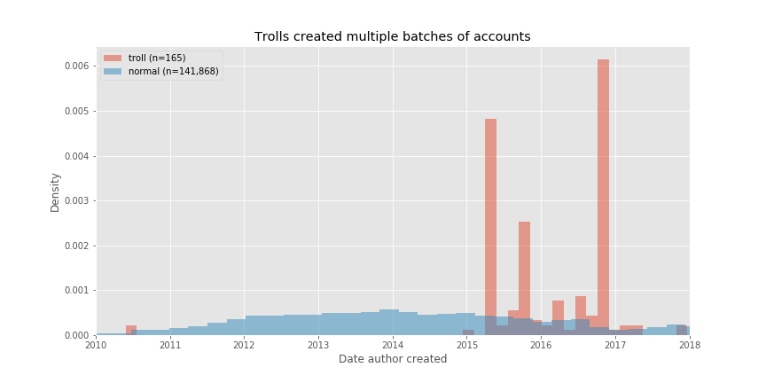
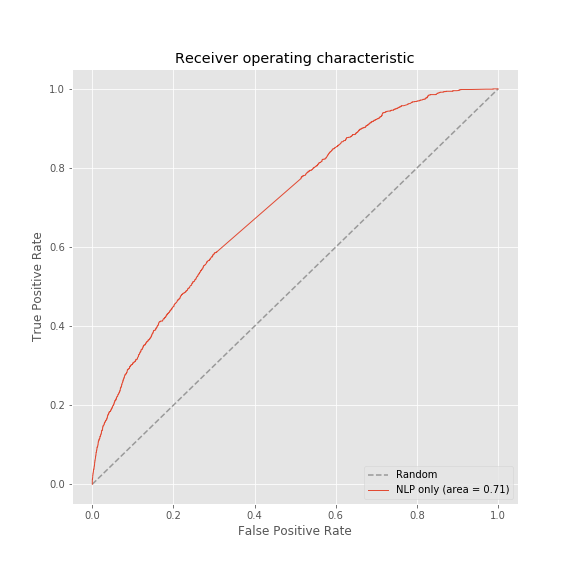
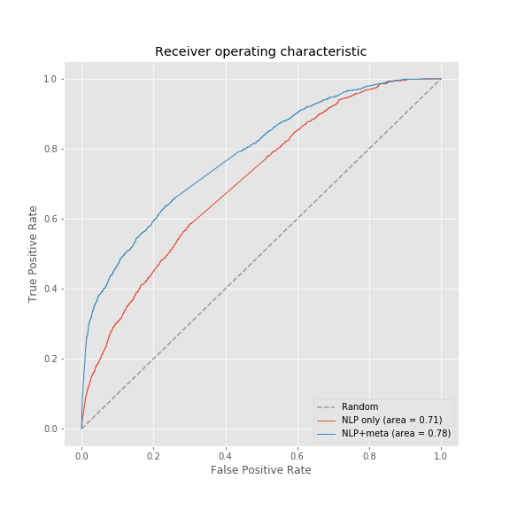

# Troll or not? Bad actors on social media

## Background

I would like a robot to tell me when I interact with someone online who is not acting in good faith. In their [2017 transparency report](https://www.reddit.com/r/announcements/comments/8bb85p/reddits_2017_transparency_report_and_suspect/), reddit labeled accounts controlled by Russia's Internet Research Agency (IRA). I gathered comments in the conversations on reddit with troll activity, then used natural language processing and random forest classifiers to predict troll status from semantic and non-semantic features of comments.

## Questions/Objectives

1) Create a model that can accurately predict whether a comment is from a Russian troll or not

2) Discover the words Russian trolls use more commonly than normal users

## Tools

1) Data collection : PushShift.io (PSAW), reddit (PRAW), Python3, Docker, MongoDB

2) Data Cleaning and Visualization: Python3, Numpy, Pandas, Matplotlib

3) Data analysis and Model Building: Python3, Numpy, Pandas, Matplotlib, Sklearn, NLTK.

## Exploratory Data Analysis

I found 6407 comments from the trolls across 223 conversations, or posts. Then I gathered all the comments from normal users in the same post. The number of accounts and comments by troll status breaks down as follows:

| Type   |    Accounts   |  Comments |
|:------:|:-------------:|:---------:|
| normal |  141,868      | 224,149   |
| troll  |   165         |   6,407   |

Each comment came with metadata, which included the timestamp for precisely when the commenter's account was created. The `author_created_utc` timestamps clustered together among the trolls whereas it was much more evenly distributed among normal users.

Cooperative activity across multiple accounts may leave this type of signature, among others. However, my classifier will not know the specific ranges of author creation dates for trolls when predicting troll status from new accounts, which means detection of clusters of `author_created_utc` timestamps are out of scope for now.

## Supervised Machine Learning

Following preparation of the comments into a corpus with NLP, I submitted the term frequency inverse document frequency to a Random Forest Classifier. Without any additional metadata, the classifier had some success at distinguishing trolls from normal users. 

Also included with the comment metadata were features for level of nesting in the conversation (`depth`) and the community's rating of the value of the comment (`score`). I added these two features to the TF-IDF feature matrix, and the classifier improved significantly.

Adding `score` and `depth` also improved the precision of the model from 5% to 9%. However, I do not want to receive so many warnings without a true positive that I get fatigued. This would make it more likely that I would ignore the classifier during my daily activities. Future work will focus on increasing precision.

## Model Inspection

To understand which terms Russian trolls used more often than normal users, I performed an analysis of feature importance based on permutations of each term in the testing data.

After `score` and `depth`, terms that differentiated trolls from normal users included `news`, `tie` (a cryptocurrency), `matter`, `cop`, `great`, `trump`, and `hillary`.

## Conclusion and Future Work

Initial results suggest there are words used differently by trolls relative to normal users. Also, metadata from a comment may be more informative about troll status than the content of the comment itself. 

Future work includes:

* confirm a complete search of the tree of comments returned by PRAW

* get more labeled data, perhaps from twitter which is more publicly active in this area than reddit

* detect `author_creation` spikes

* confirm the model works well in conversations without troll activity

One of my favorite parts of this dataset is [a casualiAMA by the trolls themselves](https://www.reddit.com/r/casualiama/comments/7m1hht/we_are_russian_trolls_ask_us_anything/), complete with self-portraits!

Thank you so much for your interest!